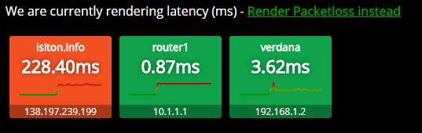

# Is It On?

A simple cross-platform ping dashboard to monitor hosts if they respond to ping.

## Screenshot

## About

The application reads `isiton.json` for a list of hostnames to ping. Each hostname is pinged once per second,
and reports average latency and packetloss every 4 pings via websocket to the VueJS front-end.

## Running the app

You can grab the built binaries from the releases page (TODO).

To build the app, you need a Linux with Docker, run `./build.sh`. Binaries will be placed in `build/`.

## Usage

~~~
Usage of ./isiton-linux-amd64:
  -config string
        config file name (default "isiton.json")
  -port string
        Port for server (default "8080")
~~~

An example isiton.json file is provided. Navigate to [http://localhost:8080](http://localhost:8080) to view the dashboard.